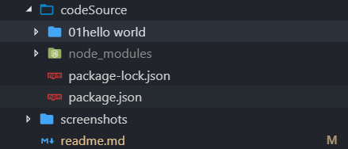
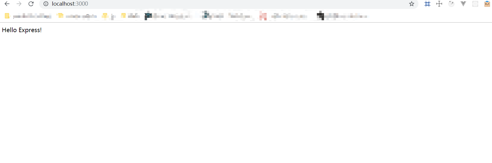
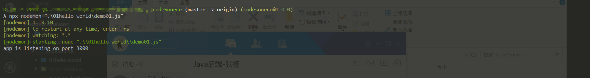

## `express`学习记录
这是我在学习`express`框架过程中对`express`基础知识学习过程的一个总结和梳理，方便自己之后的复习以及社区其它小伙的学习
### `hello world`
从这里，我们正式开始`express`框架的学习。  
首先在我们的工作目录建立`codeSource`来存放`demo`源码，然后在`codeSource`下生成`package.json`进行项目依赖管理
```
mkdir codeSource
cd codeSource
npm init -y
mkdir 01hello world
```
现在的目录结构是这样的：  


这里我们写出我们入门必备的`hello world`:
```js
const express = require('express');
const app = express();
// 读取当前目录下环境变量port的值，满足正式环境中的node服务的端口启动需求
const port = process.env.PORT || 3000;
// 当请求路径为'/'时返回'hello world'
app.get('/', (req, res) => {
  res.send('Hello Express!')
});
// 监听端口
app.listen(port, () => {
  console.log(`app is listening on port ${port}`);
});
```
安装项目需要用到的依赖并运行代码：
```
npm i express nodemon -S
npx nodemon ./01hello world/demo01.js
```
浏览器输入`localhost:3000`：  


这里简单介绍一下我们用到的依赖和工具：
* [`express`](https://github.com/expressjs/express): 一款`nodejs`的`web`框架
* [`nodemon`](https://github.com/remy/nodemon): 监测`nodejs`应用程序中的任何改变并且自动重启服务
* [`npx`](https://github.com/zkat/npx): 帮你执行依赖包里的二进制文件
可能有小伙伴没有接触过`npx`，这个工具会自动寻找`node_modules/.bin/`下的第三方依赖并进行运行，在我们不想全局安装某些依赖的时候节省了很多代码:  
```
// 查看webpack版本
node_modules/.bin/webpack -v
// 使用npx
npx webpack -v
```
当然，这只是`npx`最基础的一个功能，要想了解更多用法可以参考阮一峰老师的文章: [`npx`使用教程](http://www.ruanyifeng.com/blog/2019/02/npx.html)

### `express`中间件介绍
一个`express`应用程序，本质上就是一系列中间件函数的调用。

什么是中间件？  
`express`中的中间件其实是一个用来处理请求和响应的函数，当中间件将对应逻辑处理完成后，通过执行`next()`函数，来继续执行接下来的中间件。如果没有执行`next()`的话，请求将会挂起。

`express`中间件函数具有以下功能：
* 执行任何代码
* 修改请求(req)和响应(res)对象
* 结束请求响应周期
* 调用中间件栈中的下一个中间件函数

下面是一个中间件执行的例子：
```js
const express = require('express');
const app = express();
const port = 9000
app.use((req, res, next) => {
  console.log(1);
  next();
});
app.use((req, res, next) => {
  console.log(2);
});
app.use((req, res, next) => {
  console.log(3);
});
app.listen(port, () => {
  console.log(`app is listening on port ${port}`)
})
// 访问localhost:9000
// output: 
// 1
// 2
```

`express`框架中，中间件主要分为以下几类：
1. 应用级中间件
2. 内置中间件
3. 路由中间件
4. 错误处理中间件
5. 第三方中间件
  
接下来我们对这几类中间件进行一一介绍
#### 应用中间件
应用级别的中间件绑定到`app`对象的实例上，通过`app.use`和`app.METHOD`来进行调用。这里提到`METHOD`是`http`请求动词的小写形式。  
接下来我们通过几个例子来理解应用级别的中间件。
```js
const express = require('express');
const app = express()
const port = 9000
// 1. 没有指定请求路径：中间件函数会在应用程序每次接收到请求的时候执行
app.use((req, res, next) => {
  console.log('time:', Date.now());
  next();
})

// 2. 指定请求路径：中间件函数会在请求路径匹配`/user/:id`的时候执行，这里的请求方式是任意的
app.use('/user/:id', (req, res, next) => {
  res.send(req.params.id);
  next();
})

// 3. 指定请求路径和请求方式：中间件函数会在请求路径匹配`/goods`以及请求方式为`get`的时候执行
app.get('/goods', () => {
  res.send('GOODS');
  next();
})

app.listen(port, () => {
  console.log(`app is listening on port ${port}`);
})
```

#### 内置中间件
`express`为我们提供了如下内置中间件：
* `express.static`： 为html,images等提供静态资源服务器
* `express.json`： 解析`json`格式的请求
* `express.urlencoded`：解析`application/x-www-form-urlencoded`格式的请求

`express.json`和`express.urlencoded`是`Express v4.16.0`版本才加入的，基于第三方中间件`body-parser`，用来处理`post`请求，方便进行参数获取和逻辑处理。  

接下来我们用一个例子来演示一下`express.static`的使用：  
```js
const options = {
  dotfiles: 'ignore',
  etag: false,
  extensions: ['htm', 'html'],
  index: false,
  maxAge: '1d',
  redirect: false,
  setHeaders: function (res, path, stat) {
    res.set('x-timestamp', Date.now())
  }
}

app.use(express.static('public', options))
```
#### 路由中间件

#### 错误处理中间件

#### 第三方中间件

### `express`路由

#### 路由拆分

### 请求参数处理

#### `get`请求

#### `post`请求

### 搭建静态服务

### `express`模板引擎

### 文件上传

#### 单文件上传
#### 多文件上传
#### 文件预览
#### 将`node.js`代码部署到服务器

### `express-generator`脚手架

#### 目录结构
#### 脚手架学习
