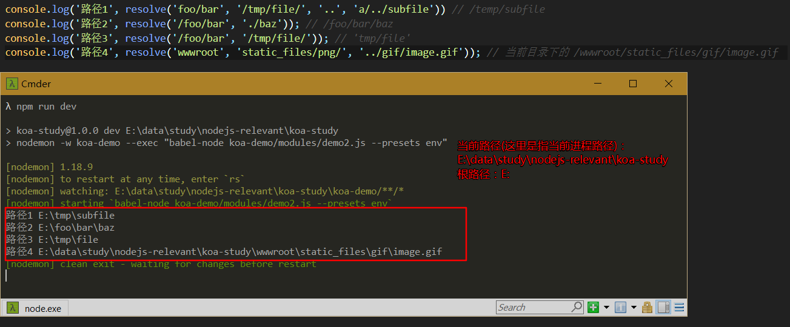

# `nodeJs`核心模块
## `http`模块
### 常用`api`学习
#### `http.createServer`
#### `response.writeHead`
#### `response.write`
#### `response.end`
#### `server.listen`

### 通过`http`模块搭建`web`服务器

## `url`模块
> [什么是URL](https://developer.mozilla.org/zh-CN/docs/Learn/Common_questions/What_is_a_URL)
### 常用`api`学习
#### `url.parse`
#### `url.format`
#### `url.resolve`

## `fs`模块

### 常用`api`学习
#### `fs.readFile`
异步的读取文件的全部内容

```js
const fs = require('fs')
const path = require('path')
// 注意：这里的路径是相对于当前进程，而不是当前脚本
// 这里通过path.resolve将路径拼接为绝对路径
fs.readFile(path.resolve(__dirname,'../../package.json'), (err,data) => {
  // data:文件的内容
  if(err) throw err
  console.log(JSON.parse(data).name) // koa-study
})
```


## `path`模块
用来处理文件与目录的路径
### 常用`api`学习
#### `path.resolve`
将路径或路径片段处理成绝对路径

拼接规则：  
* '/': 会被当成根路径来拼接
* 'a': 字符串会认为是当前路径
```js
path.resolve('foo/bar', '/tmp/file/', '..', 'a/../subfile'); // 根路径/tmp/subfile
path.resolve('/foo/bar', './baz') // 根路径/fool/bar/baz
path.resolve('wwwroot','static_files/png/', '../gif/image.gif') // 当前目录/wwwroot/static_files/gif/image.gif
```
示例：  


#### `path.join`

## `util`模块
### 常用`api`学习
#### `util.promisify`


## 全局变量
### `process`
#### `process.cwd`
返回进程的当前工作目录


