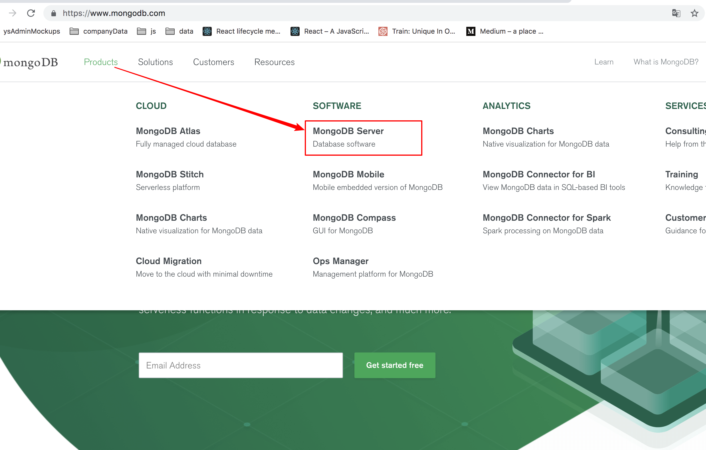
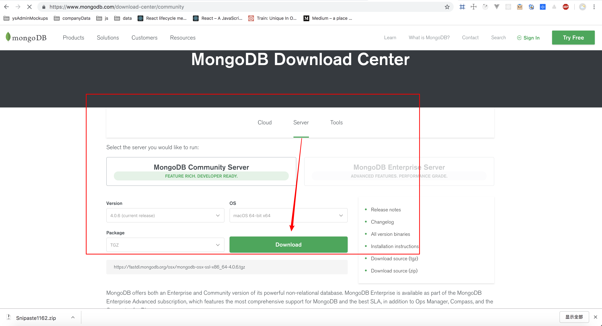
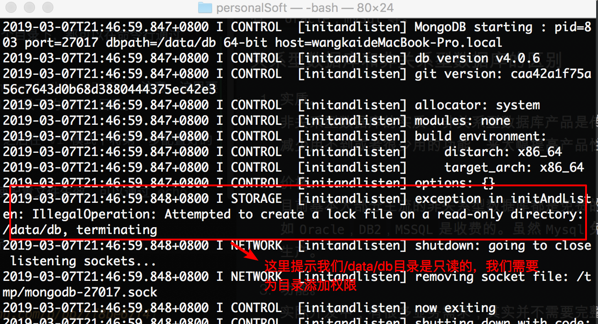
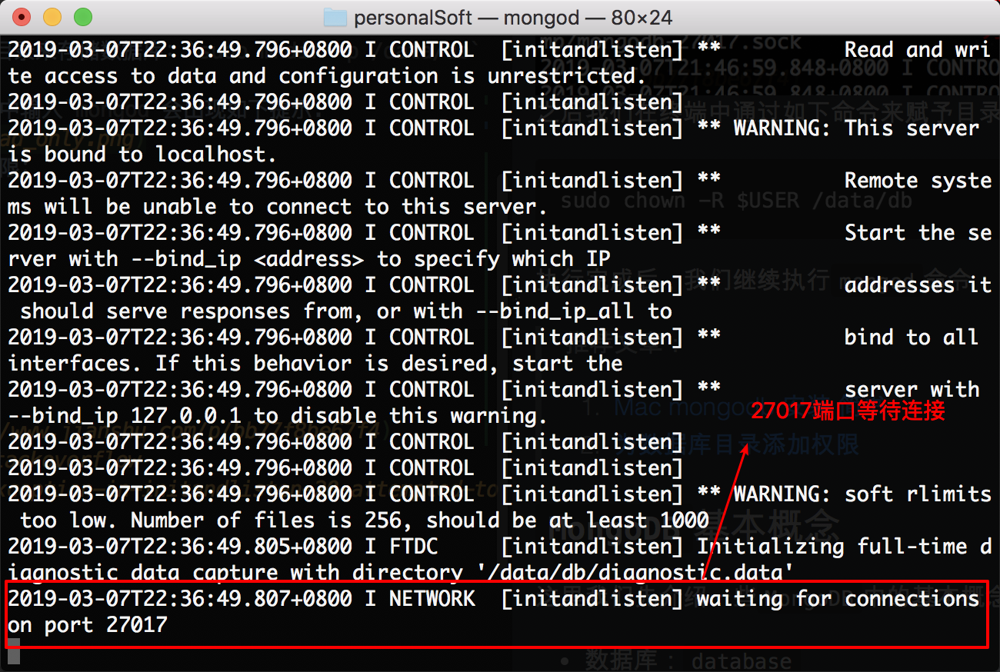
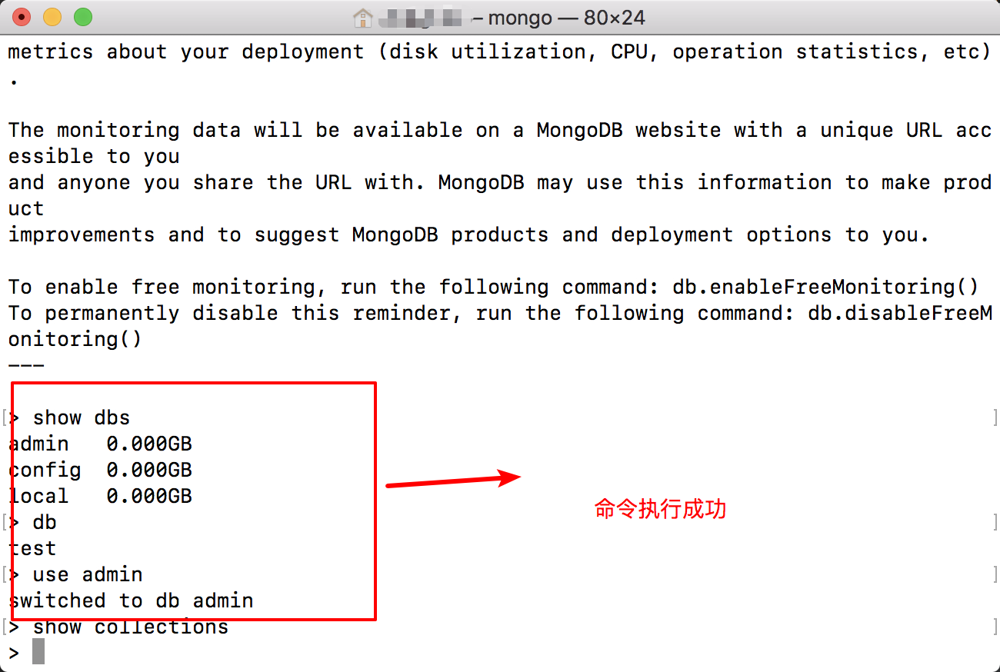
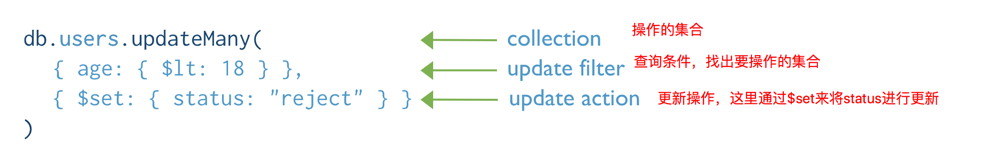

## `MongoDB`基础知识

### 常用数据库了解
> `NoSql`: not only Sql (不仅仅是Sql)

`MongoDB`是一个非关系型数据库(NoSql)。作为一个前端开发者来说，操作`MongoDB`是比较惬意的，因为`MongoDB`不用写`SQL`语句，而且里边的用法都是`JSON`对象的形式。

为了更好的理解非关系型数据库，这里我们先简单了解下关系型数据库。  
关系型数据库，是指采用了关系模型来组织数据的数据库，常用的关系型数据库有：`oracle`,`mySql`等。

#### 关系型数据库和非关系型数据库的区别
1. 实质。  
非关系型数据库的实质：非关系型数据库产品是传统关系型数据库的功能阉割版本，通过减少用不到或者很少用的功能，来大幅提高产品性能。

2. 价格。  
目前基本大部分主流的非关系型数据库都是免费的。而比较有名气的关系型数据库，比如`Oracle`,`DB2`,`MSSQL`是收费的。虽然`Mysql`免费，但它需要做很多工作才能正式用于生产。

3. 功能。  
实际开发中，有很多业务需求，其实并不需要完整的关系型数据库功能，非关系型数据库的功能就足够使用了。这种情况，使用性能更高、成本更低的非关系型数据库显然是更加明智的选择。

在比较大型的项目中，我们不建议使用非关系型数据库。但是我们只是想简单写一些小项目，比如搭建一个博客或者是`CMS`(内容管理系统)这类业务逻辑并不怎么复杂的程序，使用`MongoDB`是完全可以胜任的。
 
### 认识和安装`MongoDB`
再了解了非关系型数据库和关系型数库之后，我们接下来介绍一下`MongoDB`。

`MongoDB`是一个介于关系数据库和非关系数据库之间的开源产品，是最接近于关系型数据库的`NoSql`数据库。它在轻量级`JSON`交换基础上进行了扩展，即成为`BJSON`的方式来描述其无结构化的数据结构。

#### 安装`MongoDB`
首先打开`MongoDB`官网：https://www.mongodb.com/,然后在导航`Products`里选择`MongoDB Server`选择合适的版本。这里由于笔者使用的是`Mac`电脑，所以介绍一下`Mac`电脑的安装过程。 



下载完成后我们需要做3件事:  
1. 配置环境变量
2. 创建数据库存储目录
3. 为`MongoDB`数据库存储目录添加使用权限

首先，我们来为`MongoDB`配置环境变量，这样我们不管在个目录下，都可以在命令行通过`mongod`启动数据库，而不用再输入复杂的配置参数。

第一步，我们在终端输入：`export PATH=/usr/local/mongodv/bin:$PATH`。注意，这里要将`/usr/local/mongodv/bin`换成自己安装`MongoDB`目录下的`bin`目录。
  
第二步，在终端中输入：`sudo vi ~/.bash_profile`，之后在`vi`模式下将第一步配置好的路径复制粘贴并进行保存。

最后一步，使用`source ~/.bash_profile`更新配置，使配置文件生效。可以通过`echo $PATH`来查看当前系统环境变量

接下来我们要在磁盘根目录建立`/data/db`目录来存储数据库：`sudo mkdir -p /data/db`

在添加环境变量后和建立存储目录后，在终端中输入`mongod`会出现如下提示:

之后我们在终端中通过如下命令来赋予目录权限：
```
sudo chown -R $USER /data/db
```
执行完成后，我们继续执行`mongod`命令：

至此，我们的`MongoDB`从安装到连接已经完成了，我们可以新开一个终端并输入`mongo`，通过`mongo shell`进行一些简单命令的测试：



> 推荐文章：  
> 1. [Mac mongodb 安装 简书](https://www.jianshu.com/p/bb77f8be67f4)  
> 2. [为数据库目录添加权限](https://stackoverflow.com/questions/42446931/mongodb-exception-in-initandlisten-20-attempted-to-create-a-lock-file-on-a-rea)


### `MongoDB`基本概念
这里我们先介绍一些`MongoDB`中的基本概念：
* 数据库：`database`
* 集合：`collection`
* 文档：`document`
* 数据字段/域：`field`
* 主键： `_id`

`MongoDB`中存储的文档必须有一个`_id`键。这个键的值可以是任何类型的，默认是`ObjectId`对象。在一个集合里，每一个文档都有一个唯一的`id`值，来确保集合里的每一个文档都能被唯一标识。如果一个文档没有指定`_id`字段，`MongoDB`会自动为文档添加`_id`字段，它的值是一个唯一的`ObjectId。

`ObjectId`是一个12字节的`BJSON`类型数据，格式如下：
* 前4个字节表示时间戳
* 接下来的3个字节是机器码
* 紧接的2个字节由进程id组成（PID）
* 最后三个字节是随机数

`MongoDB`采用`ObjectId`,而不是其它的比较常规做法（比如自动增加的主键）的主要原因，是因为在多个服务器上同步自动增加主键值既费力还费时。

了解了`MongoDB`的基本概念后，我们来学习下`Mongodb`的常用操作：
* `show dbs/database`: 显示当前所有数据库
* `use 数据库名称`：进入到指定数据库中，如果当前数据库没有建立的话会自动建立
* `db`: 显示当前所处的数据库
* `show collections`: 显示当前所处数据库下的所有集合

这些简单的命令可以在上节提到的`mongo shell`进行简单练习，熟悉一下数据库的基本操作

### [`CRUD`操作](http://www.mongoing.com/docs/crud.html)
`CRUD`(创建：`Create`,读取：`Read`,更新：`Update`,删除：`Delete`)是对于存储的信息可以进行操作的同义词。是一个对四种操作持久化信息的基本操作的助记符。`CRUD`通常是指适用于存于数据库或数据存储器上的信息的操作
#### 可视化工具介绍
通过命令行来操作一些简单的数据库命令比较方便，但是进行一些相对复杂的操作时，并没有一些方便的语法提示和数据展示。接下来，我们使用相关的可视化工具来加快开发效率。

这里我们使用的是[`Robo 3T`](https://robomongo.org/download),我们可以点击链接去下载，也可以自己去官网下载。  
下载完成后界面如下：


一些常用的操作介绍：


这里我们建立一个`mongo_demos`的数据库，接下来的相关`CRUD`都会在这个数据库里进行:
```js
use mongo_demos // 进入mongo_demos数据库
db // 当前操作的数据库： mongo_demos
```
#### 插入操作(`insert`)
`MongoDB`插入操作会为一个集合添加一条新的文档，如果集合不存在的话，会自动创建。  
`MongoDB`以下方法来为集合插入文档：
* `db.collection.insert`: 向集合中插入一条或多条文档
* `db.collection.insertOne`: 向集合中插入一条文档
* `db.colleciton.insertMany`: 向集合中插入多条文档
 

接下来我们建立一个员工集合，并为集合添加几条员工信息：
```js
db.employee.insert({name:'李四', age: 18, salary: 30000})
db.employee.insert(
  [
    { name:'小李', age: 20, salary: 40000 },
    { name:'张三', age: 24, salary: 40400 },
    { name:'王五', age: 26, salary: 20000 }
  ]
)
```
上边的代码会创建`emplyee`集合，并向集合中插入4条文档，`_id`也会随着文档的插入而自动创建，来唯一标识每一条文档。  
`db.collection.insertOne`和`db.collection.insertMany`的语法和上边的代码相似，唯一的区别是`insertOne`只能插入一条文档，而`insertMany`必须插入一个数组

这里我们对插入命令的在性能方面做一个小测试。  
假如我们接到一个需求，需要在`numbers`集合中插入20000条数据。解决方案有如下俩种：
```js
// 1. 通过循环，执行20000次插入操作
for(var i=1;i<=20000;i++) {
  db.employee.insert({count:i})
}
// 5.65s

// 2. 将要插入元素构造数组，然后一次性插入
var array = []
for(var i=1;i< 20000;i++) {
  array.push({count: i})
}
db.employee.insert(array)
// 0.179s
```
可以看到，同样是插入数据，在性能上的差距却非常大。由此可以看出，`mongodb`数据库操作相对于`js`代码执行来说耗费的时间会更多，所以在使用的过程中我们要尽可能的减少数据库相关操作，提升代码的相应速度。

#### 查询操作(`find`)
文档查询是数据库的主要功能之一，在`Mongodb`中查询文档提供了如下方法：
* `db.collection.find`： 查询满足条件的所有文档
* `db.collection.findOne`：查询满足条件的文档中按照自然排序的第一条文档

参数传递如下：


接下来我们导入2个集合到`mongo_demos`数据库中，进行查询操作的演示:

这里我们成功导入和部门(dept)集合以及员工(emp)集合:
```
mongoimport -d mongo_demos -c depts --file /path/to/my/fileThatIWantToImport.json
mongoimport -d mongo_demos -c emps --file /path/to/my/fileThatIWantToImport.json
```
我们只要把上边代码中的`mongo_demos`,`depts`,`/path/to/my/fileThatIWantToImport.json`换成自己`mongoDB`中对应的数据库和集合的名字以及对应`json`文件的保存目录即可。  
具体操作可以参考： [`import a data file.json into robo3T(robomongo)`](https://stackoverflow.com/questions/23009146/import-a-data-base-file-json-into-robo3t-robomongo)

这里我们要完成几个需求：
1. 查询所有员工信息
```js
db.emp.find()
```
2. 查询姓名为孙二娘的员工信息
```js
db.emp.find({name:'孙二娘'})
```
3. 查询地点在北京的部门
```js
db.dept.find({loc: '北京'})
```
上边是最基础的查询方法的演示，接下来我们进行进一步的学习。
##### 投影
有时候，我们并不需要查询出某条文档的全部字段(field)，比如我们只想要知道员工孙二娘的薪水(salary)信息，而其它信息并不需要。显然，我们前边介绍的查询方法并不能满足需求。这里我们介绍`db.collection.find`方法的第二个参数: `projection`(投影)。  
`projection`决定匹配到的文档展示哪些字段，使用语法：`{field1:<value>,field2:<value>...}`。  
`vlaue`的取值如下：
* 1 或 true: 匹配文档展示该字段
* 0 或 false: 匹配文档不展示该字段

> `_id`字段投影属性默认为1，需要手动设置为-1,才不会在查询结果中展示

我们继续来完成几个需求：
1. 只查询姓名为孙二娘的员工的薪水情况
```js
db.emp.find({name: '孙二娘'},{_id: -1, sal: 1})
```
2. 只查询财务部的位置信息
```js
db.detp.find({dname: '财务部'},{_id: -1, loc: 1})
```
这样查询到的对应的文档就不会包含其它字段了

##### 查询操作符
这里我们继续接下来的需求：  
1. 查询工资小于2000的员工
```js
db.emps.find({sal:{$lt: 2000}})
```
2. 查询工资在1000-2000之间的员工
```js
db.emps.find({$and:[{sal:{$gt:1000}},{sal:{$lt: 2000}}]})
```
3. 查询工资在小于1000或大于2500的员工
```js
db.emps.find({$or:[{sal:{$lt:1000}},{sal:{$gt:2500}}]})
```
上边查询条件中用到的`$lt`,`$and`,`$gt`,`$or`就是查询操作符。下边我们介绍一些常用的查询操作符：  
* `$eq`: 找出等于指定查询条件的文档
* `$gt`: 找出大于指定查询条件的文档
* `$lt`: 找出小于指定查询条件的文档
* `gte`: 找出大于等于指定查询条件的文档
* `lte`: 找出小于等于指定查询条件的文档
* `$or`: 返回满足指定查询条件中的任意一条的所有文档
* `$and`: 返回满足指定查询条件中所有条件的所有文档
这里只是列出了一些常用的查询操作符，想要进行进一步深入了解可以在官网阅读详细的`api`：[传送门](https://docs.mongodb.com/manual/reference/operator/query/)

##### 游标操作
// 22.查询所有员工的数量
// 23.查看员工集合中的前5条数据
// 24.查看员工集合中的第5条到10条数据
// 25.将所有员工按照薪水升序排序
// 26.将所有员工按照薪水降序排序
#### 修改操作(`update`)
`MongoDB`的更新操作会编辑一个集合中存在的文档，它为我们提供了以下来更新集合文档的方法：
* `db.collection.updateOne`: 更新查询条件查询到的所有文档中的第一条
* `db.collection.updateMany`: 更新查询条件查询到的所有文档
* `db.collection.replaceOne`: 使用指定的文档替换查询到的文档
* `db.collection.update`: 默认情况会更新查询到的第一条文档，如果设置了`{multi:true}`会更新匹配到的所有文档

在默认情况下，更新操作会将指定文档直接替换查询文档，而不是在更改原有字段对应的值，或新添加一个字段。通常我们会通过查询操作符来处理这个问题。
```js
// 更新一个员工信息
db.emps.update({name:'林冲'},{name:'林冲1'}) // 这样会直接将原有的name为林冲的文档直接替换
db.emps.update({name:'林冲'},{$set:{name:'林冲1'}}) // 这样才是将name为林冲的文档的name修改为林冲1
```
查询`api`的常用语法介绍：  


#### 删除操作(`delete`)

### `mongoose`基本概念

