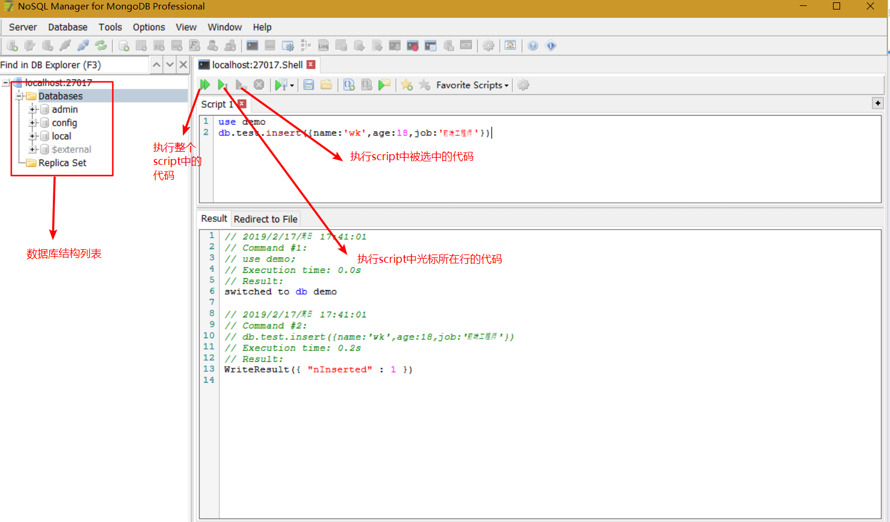
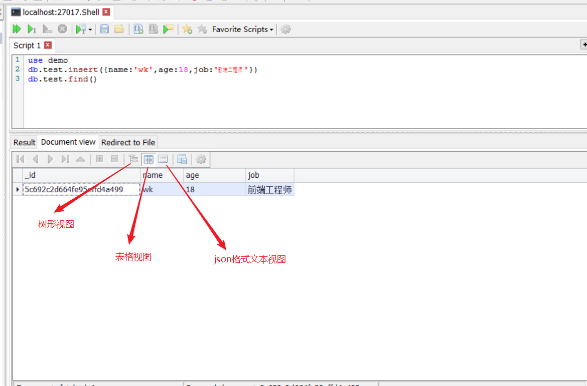

## 常用数据库了解

## 认识和安装`MongoDB`
## `Mongo`基本命令
### `MongoDB`的一些基本概念
* 数据库: `database`
* 集合: `collection`
* 文档：`document`

**在`mongoDB`中，数据库和集合都不需要手动创建。当我们创建文档时，如果文档所在的集合或数据库不存在会自动创建数据库和集合**

### 常用操作
* `show dbs/database`: 显示当前的所有数据库
* `use 数据库名称`: 进入到指定的数据库中
* `db`: 显示当前所处的数据库
* `show collection`:显示数据库中所有的集合

## [数据库`CRUD`操作](http://www.mongoing.com/docs/crud.html)
[`CRUD`](https://developer.mozilla.org/zh-CN/docs/Glossary/CRUD):（创建：Create,读取：Read,更新: Update,删除：Delete）是对于存储的信息可以进行操作的同义词。是一个对四种操作持久化信息的基本操作的助记符。

### 使用可视化工具
这里用到的是`NoSQL Mangaer for MongoDB`,大家可以到官网自行下载:https://www.mongodbmanager.com, 下载的时候选择`Freeware`免费版

这里介绍一下简单的使用方法：



接下来我们新建一个`demo`数据库，在`demo`数据库下进行增删改查的演示
```
use demo
```
### 插入文档
`db.<collection>.insert()`:向集合插入一个或多个文档
```js
db.test.insert({name:'wk',age:18,job:'前端工程师'})
db.test.insert([
  {name:'wk1',age:19,job:'UI'},
  {name:'wk2',age:20,job:'后端工程师'}
])
```

`db.<collection>.insertOne()`：向集合插入单个文档
```js
db.test.insert({name:'wk3',age:21,job:'job1'})
```
`db.<collection>.insertMany()`：向集合插入多个文档
```js
db.test.insert({name:'wk4',age: 22,job:'job2'})
```
### 查询文档
`db.<collection>.find()`: 查询集合中的所有文档

`db.<collection>.find({<filed1>:<value1>,...})`: 查询包含字段<filed>并且等于特定<value>的所有文档
```js
// 从user集合中检索status字段值为"A"的所有文档
db.users.find({status: 'A'})
```
`db.<collection>.findOne()`: 用来查询集合中符合条件的第一个文档

`db.<coolcation>.find().count()`: 查询集合中符合条件的文档的数量

### 修改文档
修改文档接收参数：  
1. 过滤条件
2. 要替换为的新文档（完全替换匹配文档，除了_id字符）
3. 选项文档 [可选]

修改操作符：
1. `$set`:用来修改文档中的指定属性
2. `$unset`: 删除文档的指定属性

在`demo`集合中插入如下文档:
```
{ "_id" : ObjectId("5c692c2d664fe95effd4a499"), "name" : "wk", "age" : 18, "job" : "前端工程师" }
{ "_id" : ObjectId("5c6d473c2bc155f6ed7c4f2b"), "name" : "花花", "age" : 28, "job" : "音乐家" }
{ "_id" : ObjectId("5c6d473c2bc155f6ed7c4f2c"), "name" : "沈腾", "age" : "30", "job" : "演员" }
{ "_id" : ObjectId("5c6d477e2bc155f6ed7c4f2d"), "name" : "贾玲", "age" : 30, "job" : "演员" }
```

`db.<collection>.update()`: 将匹配到的第一个文档全部替换为指定文档(updateOne),如果第三个参数传`{multi:true}`则将匹配到的所有文档替换为指定文档(updateMany)
```js
// 这样会进行全部替换，操作风险比较大
db.test.update({job:'演员'},{job:'高级演员'})
db.test.find()
// { "_id" : ObjectId("5c692c2d664fe95effd4a499"), "name" : "wk", "age" : 18, "job" : "前端工程师" }
// { "_id" : ObjectId("5c6d473c2bc155f6ed7c4f2b"), "name" : "花花", "age" : 28, "job" : "音乐家" }
// { "_id" : ObjectId("5c6d473c2bc155f6ed7c4f2c"), "job" : "高级演员" }
// { "_id" : ObjectId("5c6d477e2bc155f6ed7c4f2d"), "name" : "贾玲", "age" : 30, "job" : "演员" }

// 使用修改操作符进行指定字段更新
db.test.update({name:'wk'},{$set:{job:'资深前端开发'}})
db.test.find()
// { "_id" : ObjectId("5c692c2d664fe95effd4a499"), "name" : "wk", "age" : 18, "job" : "资深前端开发" }
// { "_id" : ObjectId("5c6d473c2bc155f6ed7c4f2b"), "name" : "花花", "age" : 28, "job" : "音乐家" }
// { "_id" : ObjectId("5c6d473c2bc155f6ed7c4f2c"), "job" : "高级演员" }
// { "_id" : ObjectId("5c6d477e2bc155f6ed7c4f2d"), "name" : "贾玲", "age" : 30, "job" : "演员" }

// 使用修改操作符进行指定字段删除
db.test.update({name:'贾玲'},{$unset:{job:''}})
db.test.find()
// { "_id" : ObjectId("5c692c2d664fe95effd4a499"), "name" : "wk", "age" : 18, "job" : "资深前端开发" }
// { "_id" : ObjectId("5c6d473c2bc155f6ed7c4f2b"), "name" : "花花", "age" : 28, "job" : "音乐家" }
// { "_id" : ObjectId("5c6d473c2bc155f6ed7c4f2c"), "job" : "高级演员" }
// { "_id" : ObjectId("5c6d477e2bc155f6ed7c4f2d"), "name" : "贾玲", "age" : 30 }
```

`db.<collection>.updateMany`: 更新所有通过过滤条件匹配到的文档
```js
db.test.update({job:'高级演员'},{$set:{age:30,name:'沈腾'}})
db.test.updateMany({age:30},{$set:{skill:'跳舞'}})
db.test.find()
// { "_id" : ObjectId("5c692c2d664fe95effd4a499"), "name" : "wk", "age" : 18, "job" : "资深前端开发" }
// { "_id" : ObjectId("5c6d473c2bc155f6ed7c4f2b"), "name" : "花花", "age" : 28, "job" : "音乐家" }
// { "_id" : ObjectId("5c6d473c2bc155f6ed7c4f2c"), "job" : "高级演员", "age" : 30, "name" : "沈腾", "skill" : "跳舞" }
// { "_id" : ObjectId("5c6d477e2bc155f6ed7c4f2d"), "name" : "贾玲", "age" : 30, "skill" : "跳舞" }
```

`db.<collection>.updateOne`: 更新一个符合条件的文档

### 删除文档
一般数据库中的数据都不会删除，所以删除对应的`api`会很少调用。一般会在数据中添加一个字段，来表示数据是否被删除。

* `db.<collection>.remove`: 删除单个文档或与指定过滤条件匹配的所有文档;如果第二个参数传入`{justOne: true}`,只删除符合查询条件的第一条文档;如果查询条件传入空对象`{}`会删除当前集合的所有文档
```js
// 先插入一条测试数据
db.test.insert({_id:'hello',name:'删除测试',age: 10,job:'测试'})
db.test.find()
// { "_id" : ObjectId("5c692c2d664fe95effd4a499"), "name" : "wk", "age" : 18, "job" : "资深前端开发" }
// { "_id" : ObjectId("5c6d473c2bc155f6ed7c4f2b"), "name" : "花花", "age" : 28, "job" : "音乐家" }
// { "_id" : ObjectId("5c6d473c2bc155f6ed7c4f2c"), "job" : "高级演员", "age" : 30, "name" : "沈腾", "skill" : "跳舞" }
// { "_id" : ObjectId("5c6d477e2bc155f6ed7c4f2d"), "name" : "贾玲", "age" : 30, "skill" : "跳舞" }
// { "_id" : "hello", "name" : "删除测试", "age" : 10, "job" : "测试" }

db.test.remove({_id:'hello'})
// 可以发现新添加的内容已经被删除了
db.test.find()
// { "_id" : ObjectId("5c692c2d664fe95effd4a499"), "name" : "wk", "age" : 18, "job" : "资深前端开发" }
// { "_id" : ObjectId("5c6d473c2bc155f6ed7c4f2b"), "name" : "花花", "age" : 28, "job" : "音乐家" }
// { "_id" : ObjectId("5c6d473c2bc155f6ed7c4f2c"), "job" : "高级演员", "age" : 30, "name" : "沈腾", "skill" : "跳舞" }
// { "_id" : ObjectId("5c6d477e2bc155f6ed7c4f2d"), "name" : "贾玲", "age" : 30, "skill" : "跳舞" }

// 清空集合(性能比较差，会一个一个删除)
db.test.remove({}); // db.test.find()/db.test.find({})，remove必须传参 
// 可以直接执行删除集合命令，性能较好
db.test.drop()
```

* `db.<collection>.deleteOne`: 只删除符合查询条件的第一个文档
* `db.<collection>.deleteMany`: 删除所有符合查询条件的文档
* `db.<collection>.drop`: 删除当前集合
* `db.dropDatabase`: 删除数据库

一个简单的删除`demo`:
```js
// 插入4条测试数据
db.test.insert([
  {name:'测试数据1',isDel:0},
  {name:'测试数据2',isDel:1},
  {name:'测试数据3',isDel:0},  
  {name:'测试数据4',isDel:0}
])
// 通过修改isDel字段将数据置为删除状态 
db.test.update({name:'测试数据1'},{$set:{isDel:1}})
// 只查询没有被删除的内容 
db.test.find({isDel:0})
// { "_id" : ObjectId("5c6d647a2bc155f6ed7c4f30"), "name" : "测试数据3", "isDel" : 0 }
// { "_id" : ObjectId("5c6d647a2bc155f6ed7c4f31"), "name" : "测试数据4", "isDel" : 0 }
```

## 文档之间的关系
* 一对一：夫妻
* 一对多/多对一：用户-订单，文章-评论
* 多对多：学生-老师
