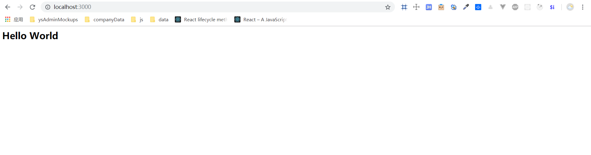

## `Node.js`基础知识整理
### 创建第一个`Nodejs`应用
> 通过向客户端返回一个最简单的'Hello World'来初步接触`Nodejs`

`node`应用的组成部分：
* `require`引入模块：通过`require`来载入用到的`Node.js`模块
* 创建服务器：监听客户端（浏览器）的请求，类似于`Apache,Nginx`等`HTTP`服务器
* 接受请求并响应请求：客户端发送`HTTP`请求，服务器接收请求后返回响应数据

接下来我们使用`Node.js`的核心模块`HTTP`来创建`Node.js`应用：[demo链接](./01%20http/demo1.js)
```js
// 引入http模块
const http = require('http');
const port = 3000;
// 调用http的createServer方法来创建服务器，监听请求并响应请求
const server = http.createServer((req, res) => {
  // 向请求发送响应头：状态码：200，文件类型：html,字符集：utf-8
  res.writeHead(200, {
    'Content-Type': 'text/html;charset=utf-8'
  });
  const html = `
    <h2>Hello World</h2>
  `;
  // 向客户端发送响应
  res.write(html);
  // 响应结束
  res.end();
});
// 监听3000端口
server.listen(port, err => {
  if (err) throw err;
  console.log(`服务已启动，监听${port}端口`);
});
```
在`demo`所在文件目录下打开终端执行`node demo1`，之后浏览器访问`localhost:3000`： 
