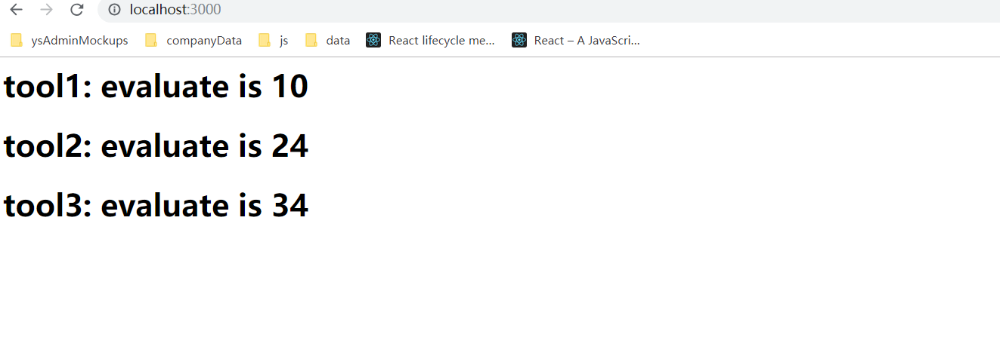

## `Node.js`基础知识整理
### `CommonJS`
#### 什么是`CommonJS`
`CommonJS`就是为`JS`的表现来制定规范，由于`js`没有模块系统、标准库较少、缺乏包管理工具，所以`CommonJS`应运而生，它希望可以在`js`的任何地方运行，而不只是浏览器中，从而达到Java、C#、PHP这些后端语言具备开发大型应用的能力。
#### `CommonJS`的应用
1. 服务端`javascript`应用程序(`Node.js`)
2. 命令行工具
3. 桌面图形界面应用程序
#### `CommonJS`与`Nodejs`的关系
`CommonJS`是模块化的标准，`Nodejs`就是`CommonJS`(模块化)的实现
#### `Nodejs`中的模块化
* 在`Node`中，模块分为俩类：一是`Node`自身提供的模块，称为核心模块；二是用户自己编写的模块，称为文件模块。核心模块在`Node`源代码的编译过程中，编译进了二进制执行文件，所以它的加载速度是最快的，如: HTTP模块，URL模块，FS模块；文件模块是在运行时动态加载的，需要完整的路径分析、文件定位、编译执行过程等......,所以它的速度相对核心模块来说会慢一些
* 我们可以将公共的功能抽离出一个单独的`js`文件来存放，然后在需要的情况下通过`exports`或`module.exports`将模块导出，并通过`require`进行引入

这里通过代码简单描述一下`module.exports`和`exports`之间的联系，不过在工作中我们还是直接使用`module.exports`比较好，防止混淆: [demo链接](./01%20common/demo2.js)
```js
// 模拟exports的实现,注意：module.exports默认值是{}
const require = () => {
  ((module, exports) => {
    // 模块代码
    const doSomething = () => {};
    // 重新赋值将不再和module.exports公用同一片内存空间
    // 此时，模块导出一个空的默认对象
    exports = doSomething;
    // 此时，该模块导出doSomething,而不是默认空对象
    module.exports = doSomething;
  })(module, module.exports);
};
```

现在我们通过三种使用方式来学习`Node`中的模块化及`exports/require`的使用

**方法一：**
> 当前目录: [01 common/myTools/tool1.js](./01%20common/myTools/tool1.js)
```js
// 定义一个工具模块
const tools = {
  add (...numbers) {
    const sum = numbers.reduce((count, item) => count + item);
    return sum;
  }
};
// 将模块暴露出去,如果没有通过module.exports暴露变量的话，默认导出{}
module.exports = tools; // {add: Function}
// modules.exports被一个新的值完全取代时，也要重新赋值exports,否则exports仍为module.exports重新赋值前的值
// console.log('exports', exports); // {}
// module.exports = exports = tools
// 不会生效的写法
// exports = tools;
// 生效的写法
// exports.tools = tools; {tools: tools}
/**
 * exports是module.exports的简写，但是如果为exports重新赋值的话，相当于重新开辟了内存空间
 * 不再和module.exports公用同一块内存空间，切断了之间的联系，此时导出的会是默认值{},或者声明定义的module.exports
 */

```
上面代码实现的效果：
1. 我们自己定义了一个`tools`工具库
2. 通过`module.exports`将`tools`导出

当模块文件较多的时候，代码会比较乱，这时候需要统一管理，`Node`为我们提供了`node_modules`目录来统一存放我们的第三方模块，所以接下来我们要介绍方法二和方法三

**方法二**:

　如果将第三方模块放入到`node_modules`中让`nodejs`来帮我们管理的话，引入的时候不需要再使用`./`或者`../`,可以直接使用模块名。这样`node`会首先在当前目录下进行查找，如果没有找到的话会进入到`node_modules`中进行查找
> 当前目录: [01 common/node_modules](./01%20common/node_modules/tool2.js)
```js
const tools = {
  multiply (...numbers) {
    const result = numbers.reduce((count, item) => count * item);
    return result;
  }
};

module.exports = tools;
```

**方法三**：

通过`package.json`来引入文件： 
1. 在当前目录(tool3,即第三方模块的根目录下)执行`npm init -y`生成`package.json`文件
2. `package.json`文件中会告诉我们程序的入口文件: `"main": "tool.js"`
3. `nodejs`通过`require`查找到`tool3`，发现目录下有`package.json`文件
4. `node`执行`package.json`中写明的入口文件`tool.js`
> 当前目录： [01 common/node_modules/tool3/tool.js](./01%20common/node_modules/tool3/tool.js)
```js
const tool = {
  add (...numbers) {
    const sum = numbers.reduce((count, item) => count + item);
    return sum;
  },
  multiply (...numbers) {
    const result = numbers.reduce((count, item) => count * item);
    return result;
  }
};
module.exports = tool;
```

##### 小节
接下来，我们分别使用三种方法来实现模块的引入并使用
> 当前目录：[01 common/demo1.js](./01%20common/demo1.js)
```js
// 自定义模块
const tool1 = require('./myTools/tool1');
// 通过node_modules进行包管理
const tool2 = require('tool2');
// 通过`package.json`中的入口文件导入模块
const tool3 = require('tool3');
const http = require('http');
http.createServer((req, res) => {
  const result1 = tool1.add(1, 2, 3, 4);
  const result2 = tool2.multiply(1, 2, 3, 4);
  const result3 = tool3.add(1, 2, 3, 4) + tool3.multiply(1, 2, 3, 4);
  res.writeHead(200, {
    'Content-Type': 'text/html;charset=utf-8'
  });
  const html = `
    <div>
      <h1>tool1: evaluate is ${result1}</h1>
      <h1>tool2: evaluate is ${result2}</h1>
      <h1>tool3: evaluate is ${result3}</h1>
    </div>
  `;
  res.write(html);
  res.end();
}).listen(3000, err => {
  if (err) throw err;
  console.log(`server listening on port 3000`);
});
```
打开浏览器输入`localhost:3000`就可以看到我们的执行结果了:

### `npm`与包
> `npm`是世界上最大的开放源代码生态系统。我们可以通过`npm`下载各种各样的第三方模块(package：包)。在安装`Node`的时候，会默认安装`npm`。

`Nodejs`中除了它自己提供的核心模块之外，还可以自定义模块，以及使用**第三方模块**。`Node`的第三方模块由`npm`提供的包组成，可以通过包来对一组具有相互依赖关系的模块进行统一管理。

查找第三方模块的方法：
* 搜索引擎：直接查找你需要安装的第三方模块的关键字，并根据`readme`进行安装使用
* [`npm`官网](https://www.npmjs.com/): 通过包的名字直接进行搜索。（推荐在官网进行搜索，效果更好）
  
一些基础的`npm`命令：
* npm -v: 查看`npm`版本
* npm ls: 查看当前目录下都安装了哪些`npm`包
* npm install/i 模块名@版本号: 安装该模块的指定版本
* npm info 模块名：查看该模块的版本及内容
  
在使用`npm`的过程中，经常会用到的一些`npm`基础知识：
* i/install: 安装模块。使用`install`或者简写`i`都表示要下载包
* unstall: 卸载模块。如果你安装错了，或者不想使用某一个模块，可以使用`unstall`卸载它
* g(global): 全局安装。将包安装到计算机中，你可以在计算机任何一个位置使用它
* --save-dev/-D: 通过这种方式安装的包的名称及版本号会出现在`package.json`中的`devDependencies`中。`devDependencies`只在开发环境中使用。例如：`webpack-bundle-analyzer`使用来分析生产环境打包后代码的资源组成，程序运行时并不需要，所以通过`-D`命令来安装
  
下面是2个安装示例：
```shell
npm i webpack-bundle-analyzer -S
npm i axios -D
```

在实际项目中，我们会通过`package.json`来对使用`npm`安装的第三方模块进行管理。如果我们需要创建`package.json`,那我们应该在指定的包管理目录中通过以下命令进行生成：
```
npm init : 按步骤创建`package.json`
npm init -y : 快速创建`package.json`
```

由于国内网络的原因，有时候通过`npm`下载包可能会很慢或直接卡掉，这时候需要我们修改下载源为淘宝源：
```
npm config set registry http://registry.npm.taobao.org/
```
这里为大家推荐一个好用的工具来进行`npm`下载源的管理：[nrm](https://github.com/Pana/nrm)

### 创建第一个`Nodejs`应用
> 通过向客户端返回一个最简单的'Hello World'来初步接触`Nodejs`

`node`应用的组成部分：
* `require`引入模块：通过`require`来载入用到的`Node.js`模块
* 创建服务器：监听客户端（浏览器）的请求，类似于`Apache,Nginx`等`HTTP`服务器
* 接受请求并响应请求：客户端发送`HTTP`请求，服务器接收请求后返回响应数据

接下来我们使用`Node.js`的核心模块`HTTP`来创建`Node.js`应用：[demo链接](./02%20http/demo1.js)
```js
// 引入http模块
const http = require('http');
const PORT = 3000;
// 调用http的createServer方法来创建服务器，监听请求并响应请求
const server = http.createServer((req, res) => {
  // 向请求发送响应头：状态码：200，文件类型：html,字符集：utf-8
  res.writeHead(200, {
    'Content-Type': 'text/html;charset=utf-8'
  });
  const html = `
    <h2>Hello World</h2>
  `;
  // 向客户端发送响应
  res.write(html);
  // 响应结束
  res.end();
});
// 监听3000端口
server.listen(PORT, err => {
  if (err) throw err;
  console.log(`server listening on port ${PORT}`);
});
```
在`demo`所在文件目录下打开终端执行`node demo1`，之后浏览器访问`localhost:3000`： 


### `url`模块
`url`模块用于处理于解析`URL`。使用方法如下：
```js
const url = require('url')
```

**`Web`中的[`URL`](https://developer.mozilla.org/zh-CN/docs/Learn/Common_questions/What_is_a_URL): 统一资源定位符**

一个`URL`由不同的部分组成，其中一些是必须的，而另一些是可选的。我们以下面的`URL`为例，学习一下其中最重要的部分:
```
http://www.example.com:80/path/to/myfile.html?key1=value1&key2=value2#SomewhereInTheDocument
```
* 协议： `http://`(Protocol),表明浏览器必须要使用何种协议
* 域名：`www.example.com`(Domain Name),表明正在请求哪个`Web`服务器
* 端口: `:80`(Port),表示用于访问`Web`服务器上的资源的技术"门"
* 网络服务器上资源的路径：`/path/to/myfile.html`(Path to the file)
* 提供给网路服务的额外参数: `?key1=value1&key2=value2`(Parameters),这些参数是用`&`符号分割的键值对列表
* 资源本身的另一部分锚点：`#SomewhereInTheDocument`(Anchor)

> 当前目录：[03 url/demo2.js](./03%20url/demo2.js)

接下来，我们通过一个例子来演示`NodeJS`中的`URL`模块,来解析请求地址中的额外参数:  
```js
// 1.引入http模块
const http = require('http');
// 2.引入url模块
const url = require('url');
const PORT = 3000;
// 3. http模块创建服务
http.createServer((req, res) => {
  // 4. 浏览器访问地址：localhost:3000?pageSize=10&pageIndex=2
  if (req.url !== '/favicon.ico') {
    /**
     * url.parse方法一般需要2个参数
     *  1. url地址
     *  2. 如果传入true,通过key1=val1&key2=val2&key3=val3传递的额外参数会转换为对象
     */
    const result = url.parse(req.url, true);
    console.log(result);
    // Url {
    //   protocol: null,
    //     slashes: null,
    //     auth: null,
    //     host: null,
    //     port: null,
    //     hostname: null,
    //     hash: null,
    //     search: '?pageSize=10&pageIndex=2',
    //     query: [Object: null prototype] { pageSize: '10', pageIndex: '2' },
    //   pathname: '/',
    //     path: '/?pageSize=10&pageIndex=2',
    //     href: '/?pageSize=10&pageIndex=2'
    // }
    let html = '', extraParams = result.query;
    for (let key in extraParams) {
      html += `<h3>${key}:${extraParams[key]}</h3>`;
    }
    res.setHeader('Content-Type', 'text/html;charset=utf-8');
    res.write(html);
    res.end();
  }
}).listen(PORT, err => {
  if (err) throw err;
  console.log(`server listening on port ${PORT}`);
});
```

浏览器访问`http://localhost:3000/?pageSize=10&pageIndex=2`: 


在代码中我们通过`url.parse`方法对请求路径进行解析，并通过`query`属性获取到了额外参数，接下来我们继续学习`url`模块的其它`api`

#### 常用`api`
> 当前目录：[03 url/demo2.js](03%20url/demo2.js)
1. `url.parse`
    ```js
    url.parse('www.baidu.com/new?name=zhangsan&age=14')
    /**
    *Url {
       protocol: null,
       slashes: null,
       auth: null,
       host: null,
       port: null,
       hostname: null,
       hash: null,
       search: '?name=zhangsan&age=14',
       query: 'name=zhangsan&age=14',
       pathname: 'www.baidu.com/new',
       path: 'www.baidu.com/new?name=zhangsan&age=14',
       href: 'www.baidu.com/new?name=zhangsan&age=14' } 
    */
    // 传入第二个参数来将额外参数处理为对象格式
    url.parse('www.baidu.com/new?name=zhangsan&age=14', true)
    // query属性是一个对象
    /**
    *Url {
       protocol: null,
       slashes: null,
       auth: null,
       host: null,
       port: null,
       hostname: null,
       hash: null,
       search: '?name=zhangsan&age=14',
       query: [Object: null prototype] { name: 'zhangsan', age: '14' },
       pathname: 'www.baidu.com/new',
       path: 'www.baidu.com/new?name=zhangsan&age=14',
       href: 'www.baidu.com/new?name=zhangsan&age=14' }
    */
    ```
2. `url.format`
    ```js
    // 将URL对象转换为URL字符串
    url.format({
      protocol: null,
      slashes: null,
      auth: null,
      host: null,
      port: null,
      hostname: null,
      hash: null,
      search: '?name=zhangsan&age=14',
      query: { name: 'zhangsan', age: '14' },
      pathname: 'www.baidu.com/new',
      path: 'www.baidu.com/new?name=zhangsan&age=14',
      href: 'www.baidu.com/new?name=zhangsan&age=14' 
    })
    // Console:
    // www.baidu.com/new?name=zhangsan&age=14
    ```
3. `url.resolve`
    ```js
    // 以一种`web`浏览器解析超链接的方式把一个目标URL解析成相对于一个基础URL
    console.log(url.resolve('/one/two/three', '/four'));
    // /four
    console.log(url.resolve('/one/two/three', 'four'));
    // /one/two/four
    console.log(url.resolve('http://example.com', 'one'));
    // http://example.com/one
    console.log(url.resolve('http://example.com/one', 'two'));
    // http://example.com/two
    console.log(url.resolve('http://example.com/one/', 'two'));
    // http://example.com/one/two
    console.log(url.resolve('http://example.com/one', '/two'));
    // http://example.com/two
    ```
    
这里只介绍了几个稍微常用一些的`api`,更多的`url`相关`api`可以去`node`官网深入学习: [`url-URL`](http://nodejs.cn/api/url.html)

### `fs`文件系统
`fs`提供了一系列`API`,来让`NodeJS`可以与操作系统的文件进行交互。所有文件系统操作都有同步和异步的形式，大多数情况下我们会使用异步形式，防止进程阻塞，提供性能

这里我们通过下面的几个`API`来学习`fs`文件系统：
1. `fs.stat`: 检测正在处理的是文件还是目录
2. `fs.mkdir`: 创建目录
3. `fs.writeFile`：将数据写入文件，如果文件存在则覆盖该文件
4. `fs.appendFile`: 将数据追加到文件，如果文件尚不存在则创建该文件
5. `fs.readFile`: 读取文件的全部内容
6. `fs.readdir`：读取目录内容
7. `fs.rename`: 文件重命名
8. `fs.rmdir`: 删除目录
9. `fs.unlink`: 删除文件

**这里需要留意：`fs`操作的第一个参数如果是文件路径的话，相对路径将相对于`process.cwd()`指定的当前工作目录进行解析**
> 当前目录：[04 fs/demo1.js](./04%20fs/demo1.js)

首先，我们通过`fs.stat`检测当前操作的内容是文件还是目录：
```js
const fs = require('fs');

fs.stat('./statTest.txt', (err, stats) => {
  if (err) throw err;
  // fs.Stats对象：提供有关文件的信息
  console.log('stats', stats);
  // Stats {
  //   dev: 2280844857,
  //     mode: 33206,
  //     nlink: 1,
  //     uid: 0,
  //     gid: 0,
  //     rdev: 0,
  //     blksize: undefined,
  //     ino: 2251799813687678,
  //     size: 0,
  //     blocks: undefined,
  //     atimeMs: 1550466987951.39,
  //     mtimeMs: 1550466987951.39,
  //     ctimeMs: 1550466987951.39,
  //     birthtimeMs: 1550466987951.39,
  //     atime: 2019-02-18T05:16:27.951Z,
  //     mtime: 2019-02-18T05:16:27.951Z,
  //     ctime: 2019-02-18T05:16:27.951Z,
  //     birthtime: 2019-02-18T05:16:27.951Z }

  // stats.isFile(): 如果操作的是文件，返回true
  // stats.isDirectory(): 如果操作的是文件系统目录，则返回true
  console.log(`文件：${stats.isFile()}`); // 文件: true
  console.log(`目录：${stats.isDirectory()}`); // 目录：false
});
```

然后，我们进行目录的删除和创建:
> 当前目录： [04 fs/demo2.js](./04%20fs/demo2.js)
```js
const fs = require('fs');
/**
* 参数1：创建路径
* 参数2：回调函数，用来传递错误信息
*/


fs.mkdir('./mkdirTest', (err) => {
  if (err) {
    console.log(`创建失败 ${err.message}`);
  }
  console.log('目录创建成功');
  fs.rmdir('./mkdirTest', (err) => {
    if (err) {
      console.log(`删除失败 ${err.message}`);
    }
    console.log('删除目录成功');
  });
});
```
执行代码后，浏览器控制台会提示错误信息，删除失败，之后会创建`mkdirTest`

接着，我们进行文件数据的写入:
> 当前目录：[04 fs/demo3.js](./04%20fs/demo3.js)
```js
const fs = require('fs');
/**
* path: 写入文件的路径，没有该文件会自动创建
* data: 要写入文件的内容(会覆盖原有内容)
* callback: 处理错误信息
*/

fs.writeFile('./writeTest.txt', 'hello nodejs', (err) => {
  if (err) {
    console.log(`写入失败 ${err.message}`);
    return;
  }
  console.log('写入数据成功');
  // 删除writeTest.txt
  fs.unlink('./writeTest.txt', (err) => {
    if (err) {
      console.log(`删除文件失败 ${err.message}`);
      return;
    }
    console.log('删除文件成功');
  });
});
```
执行上述代码后，首先会判断当前目录下是否有writeTest.txt文件，如果有的话，使用hello nodejs将原有内容覆盖，如果没有的话，会先创建writeTest.txt,然后在文件中写入hello nodejs。如果writeText文件写入成功的话，会继续删除文件

对应于`fs.writeFile`覆盖文件，`fs.appendFile`提供了追加文件内容的功能：
> 当前目录：[04 fs/demo4.js](./04%20fs/demo4.js)
```js
const fs = require('fs');
/**
* path: 文件路径
* data: 追加的内容
* callback: 处理错误信息
*/
fs.appendFile('./appendTest.txt', ',我是追加的内容', (err) => {
  if (err) {
    console.log('追加失败');
    throw err;
  }
  console.log('追加成功');
});
```
打开当前目录下的appendText.txt,发现内容由：
```
我是原来的内容
```
变成：
```
我是原来的内容
,我是追加的内容
```

之后按照我们的节奏来继续学习`fs.readFile`(读取文件)和`fs.readdir`(读取目录):
> 当前目录: [04 fs/demo5.js](./04%20fs/demo5.js)
```js
const fs = require('fs');
/**
 * path: 读取文件路径
 * callback: err:错误信息，data:读取的文件内容(Buffer)
 */
fs.readFile('./readFileTest.txt', (err, data) => {
  if (err) {
    console.log(`文件读取失败 ${err.message}`);
    return;
  }
  console.log('文件读取成功:', data.toString());
  // 文件读取成功: 读取文件操作测试
});

/**
 * path: 读取文件路径
 * callback: err: 错误信息，files: 目录下文件名组成的数组
 */
fs.readdir('../04 fs', (err, files) => {
  if (err) {
    console.log(`目录读取失败 ${err.message}`);
    return;
  }
  console.log('目录读取成功:', files);
  // 目录读取成功: [ 'appendTest.txt',
  //   'demo1.js',
  //   'demo2.js',
  //   'demo3.js',
  //   'demo4.js',
  //   'demo5.js',
  //   'mkdirTest',
  //   'readFileTest.txt',
  //   'statTest.txt' ]

});
```

### `path`路径操作

### 创建`Web`服务器

### 非阻塞I/O,事件驱动

### 模拟`get`与`post`请求

### `Node`连接`MongoDB`
